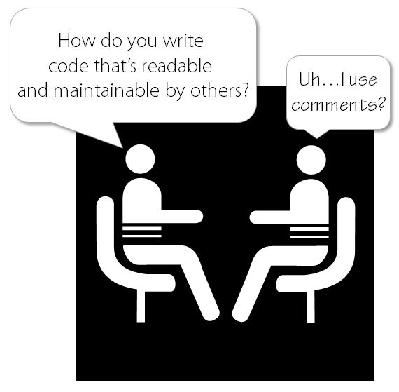

### Note

Organize the names we give to our variables, methods, classes, arguments, and packages by following some simple rules (longer descriptions at the bottom).

**NOTE: I refer to any coding objects (variable, class, method, etc.) that would be given a name as an "entity" to reduce redundancy.**

### Rules

- The name should fully reveal the intent of its use.
- Names should not misinform the reader.
- Have meaningful distinctions in the name
- Try to use pronounceable names when possible, this will help significantly when programming with others.
- Use names that are easy to find by search.
- No encodings, it can be messy, misleading, and hard to find in a search.
- It's a waste of time to prefix member variables.

### Rules Explained

**Name with intent**
Take time when trying to determine a name. Think about the variable, method, etc. and the purpose it serves within the project's scope.
_PS: If it needs a comment (near its declaration) to describe what it is, then rename it._

**Don't misinform**
Entities will be read by both yourself and possibly other people in the future. So a name that misinforms the reader about the entity will be hard to understand it's purpose at a later date.

**Meaningful Distinctions**
This is fairly simple, just don't use characters that look like others if they are not in a word/group. Here is an example of how the lowercase L can be confused with the number 1, and how an uppercase O can be confused with a 0. Although this only happens when using certain fonts, if you use a "code" font the it shouldn't be an issue (can't speak for your co-workers).

```python
a = 01
b = 0l
c = O1
d = Ol
```

**Searchable name**
Avoid using names that contain single letters and single digits, as this is harder to search for across a project. If single letters must be used, say for temporary variables, then only use them as local variables in short methods.

**No encodings**
Bad encoding is illogical, confusing, and not helpful for anyone other than the programmer that wrote it (including 6 months later original programmer).

```python
Z7_DaysLeft = 23
```

**Prefix member variables**
There is no need to prefix variables that belong to a class because your classes (and functions) should be small enough that you wouldn't need to organize them. They are also easily ignored after working with them for more than a few days, which ends up making the code look really messy by having mixed patterns.  

```python
class Barrel:
    m_weightInLbs = 23
    __pm_secretIngredient = 'Soylent Green'

    def fill():
        l_lbsLeft = m_weightInLbs
```
```
Key:
l_    = local
m_    = member
__pm_ = private member
```

---

### Wise Words and Quotes

> "Do not refer to a grouping of accounts as an accountList unless it’s actually a List. The word list means something specific to programmers. If the container holding the accounts is not actually a List, it may lead to false conclusions. So accountGroup or bunchOfAccounts or just plain accounts would be better."
> - Robert C. Martin

> "The length of a name should correspond to the size of its scope."
> - Robert C. Martin

<div style="text-align:center"></div>
