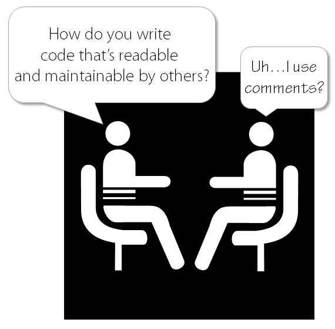

Title: Organizing Naming Rules & Conventions
Date: 2017-11-23 04:27 
Category: Clean Code
Slug: organizing-naming-rules-conventions
Status: published
Summary: When we write code, we must be conscious of our naming conventions, as they hold a lot of meaning and will be seen by others.

### Note:

Organize the names we give to our variables, methods, classes, arguments, and packages by following some simple rules
(longer descriptions at the bottom). I refer to these coding objects that I give names as "entities" to keep it simple.

---

### Rules:

  - The name should fully reveal the intent of its use.
  - Names should not misinform the reader.
  - Have meaningful distinctions in the name
  - Try to make the names pronounceable names when possible, this will help significantly once you start programming
    with others.
  - Use names that are easy to find by search.
  - No encodings, it can be messy, misleading, and hard to find in a search.
  - It's a waste of time to prefix member variables.

---

### Rules Explained:

**Names with intent**  
Take time when trying to determine a name. Think about the variable,
method, etc.  and the purpose of it being created, what use it serves
(within the project's scope), and how it is used.  

PS: If it needs a comment (near its declaration to describe) what it is,
then rename it.

**Don't misinform**  
Entities will be read by both yourself and possibly other people in the
future. So a name that misinforms the reader about the entity will be
hard to know it's purpose at a later date.

**Meaningful Distinctions**  
This is fairly simple, just don't use characters that look like others
if they are not in a word/group. Here is an example of how the lowercase
L can be confused with the number 1.  
```python
l = 01
a = l
a = O1
```

**Searchable name**  
Avoid using names that contain single letters and single digits, as this
is harder to search for across a project. If single letters must be
used, say for temporary variables, then only use them as local variables
in short methods.

**No encodings**  
An example of bad encoding, which is illogical, confusing, and is not helpful
for anyone other than the programmer that wrote it.
```python
var Z7_DaysLeft = 23
```

**Prefix member variables**  
There is no need to prefix variables that belong to a class because your
classes (and functions) should be small enough that you wouldn't need to
organize them. They are also easily ignored after a period of time
working with them while making the code look really messy.  
\---  
Example of a prefixed member variable
```python
class Barrel:
    m_weightInLbs = 23
```

---

### Wise Words and Quotes:

> "Do not refer to a grouping of accounts as an accountList unless it’s
> actually a List. The word list means something specific to
> programmers. If the container holding the accounts is not actually a
> List, it may lead to false conclusions. So accountGroup or
> bunchOfAccounts or just plain accounts would be better."
>
> \- Robert C. Martin

> "The length of a name should correspond to the size of its scope."
>
> \- Robert C. Martin

---

:
